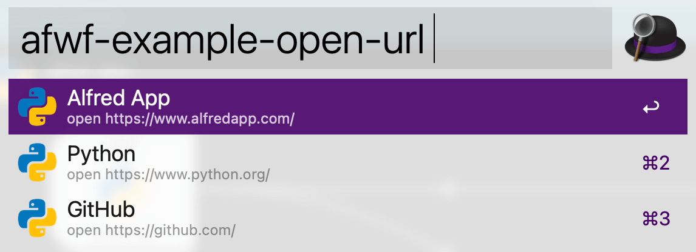
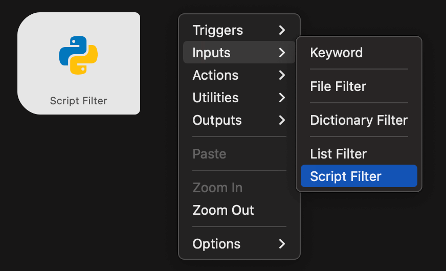

Alfred Workflow Script Filter
==============================================================================

Summary
------------------------------------------------------------------------------
这篇文档是用 Python 来开发 Alfred Workflow 的指南系列的第一篇. Alfred Workflow 的杀手功能是 `Script Filter <https://www.alfredapp.com/help/workflows/inputs/script-filter/>`_, 允许用户用任何编程语言来处理 UI 中的输入并返回 Dropdown menu 中的 Item. 由于你能使用任何编程语言, 所以理论上你用 Alfred Workflow 可以做到任何事. 那么我们就以介绍 Script Filter 作为开始吧.

Alfred UI 交互的底层逻辑
------------------------------------------------------------------------------
在聊 Script Filter 之前, 我们来聊一下 Alfred UI 交互的底层逻辑.  Alfred 是一个快速启动器, 它的交互逻辑本质上是输入一个 ``Keyword`` (关键字) 以及 ``Query String`` (查询字符串). ``Keyword`` 决定了用什么样的逻辑去处理, 而 ``Query String`` 则是输入, 经过 ``Keyword`` 所对应的逻辑去计算, 返回一些输出, 并以 Drop Down Menu 的形式展示输出并与用户互动.

以下图为例, 当你输入 ``afwf-example-open-url`` keyword 后, 就会列出一堆 URL. 而你输入 Query 之后可以根据 URL 的 Title 对这个列表进行重新排序. 而你按回车则会打开对应的 URL. 这里面每个可选的对象叫做 ``Item``, 其本质是一个 JSON 对象, 有 title, 有 subtitle, 有 icon.

所以这里最重要的就是 Query String (输入), Keyword (对应一段用编程语言实现的逻辑), 以及返回的 Drop Down Menu (输入). 这其实对应着编程语言中的函数的概念. Keyword 就是一个函数, Query String 就是输入, 而 Drop Down Menu 就是输出. 换言之, 你想要实现任何功能, 只需要根据你所期待的 Query 和 Drop Down Menu 的输入输出逻辑关系用编程语言实现并封装为一个函数即可.

下面, 我们来看看什么是 Script Filter.

什么是 Script Filter
------------------------------------------------------------------------------
Script Filter 是 Alfred Workflow 中最强大的 Widget. 当你输入了一个 Query 之后, 你可以将其作为输入传递给你用任何编程语言实现的脚本, 处理输入, 并返回一个 JSON 对象, 以此来构建 Drop Down Menu.

我们以 Alfred 的文件搜索功能为例, 你输入 ``open {query}``, Alfred 使用 MacOS 自带的文件 Metadata 索引查找文件并以 Dropdown menu 的形式返回, 这就是 open 这个关键字的处理逻辑. 但这个逻辑是 Alfred 自己实现的. 如果你会一些编程, 那么 Alfred 允许你用你擅长的编程语言自己实现这个逻辑. 这是 Alfred 的大杀器, 理论上你能利用这个功能开发任何复杂的应用.

.. _script-filter-programming-model:

Script Filter Programming Model (编程模型)
------------------------------------------------------------------------------
我们这里以 Python 为例 (Alfred 支持任何编程语言, 只要你能在 Mac 上自己安装好运行环境, Java, Ruby, Go 都不是问题). 每当你敲入 Query String 的时候, 你可以用 bash 命令创建一条命令, 例如 ``/usr/bin/python main.py {query}``. 然后你的 ``main.py`` 程序对 query 进行处理, 然后返回一个 JSON 对象. 返回的 JSON 必须包含一个特殊的字段 ``items``, 里面是一堆 item object, 每个 item object 就代表着 Dropdown menu 下的一个 item. 包含了 title, subtitle, 点 copy 或者回车后执行的 argument, 按下 cmd, shift, alt, ctrl 会有什么变化, 等等一切的功能都用 item object 这个抽象包含在其中了. 返回的 JSON 对象需要以字符串的方式发送到 standard out 中就能被 Alfred 所捕获, 并渲染成 Drop Down Menu 中的 Item 了.

举例来说, 如果我们的 Workflow 的逻辑是无论用户输入什么 Query, 都返回一个 "Hello Alfred User", 按下回车后自动跳转到 Alfred 官网. 那么返回的 JSON 就应该长这个样子:

.. code-block:: javascript

    {
        "items": [
            {
                "uid": "i-1",
                "title": "Hello Alfred User",
                "subtitle": "open https://www.alfredapp.com/ in browser",
                "arg": "https://www.alfredapp.com/"
            }
        ]
    }

Ref:

- Script Filter 的编程模型: https://www.alfredapp.com/help/workflows/inputs/script-filter/json/
- 参考这段 Alfred 作者的代码: https://github.com/deanishe/alfred-workflow/blob/master/workflow/workflow.py#L2176

What's Next?
------------------------------------------------------------------------------
相信你现在已经理解 Alfred 的 Script Filter 是如何工作的了, 相信你会迫不及待的想要创建自己的 Workflow 了. 但请别急, 请进入下一章来了解如何用 Python 来开发 Alfred Workflow.
