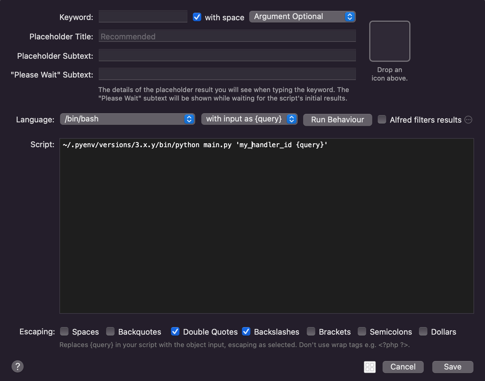

Alfred Workflow Python Developer Guide
==============================================================================

Summary
------------------------------------------------------------------------------

Why Python?
------------------------------------------------------------------------------
虽然这段的标题是 为什么用 Python? 但实际上用任何一种编程语言来写 Alfred Workflow 都可以. 只不过由于 Alfred Workflow 项目就不是企业内部的那种需要复杂的多人协作, 版本稳定的项目, 而通常是比较开源项目的风格. 由于 Python 在 Mac 上系统自带, 开发容易, 发布也容易, 所以我就选择用 Python 作为 Alfred Workflow 项目的主力语言了.

.. _script-filter-s-script:

Script Filter's Language and Script
------------------------------------------------------------------------------
当你在 Alfred Workflow 中创建了一个 ``Script Filter`` 的控件后, 你会发现这个控件有一个 ``Language`` 和 ``Script`` 的配置项. 这个两个配置项合起来就构成了每次你在 Alfred 输入框输入字符的时候在后所调用的命令. 例如当 ``Language`` 是 ``/bin/bash`` 而 ``Script`` 是 ``/usr/bin/python3 main.py {query}`` 的时候, 假设你输入的字符是 hello, 那么后台运行的命令就是相当于在 Bash 脚本中运行 ``/usr/bin/python3 main.py hello``. 不得不佩服 Alfred 作者的智慧, 这种设计非常灵活, 使得你几乎可以用任何编程语言做任何事.

那么问题来了, 既然 Script Filter 这么灵活, 有没有一种最佳实践呢? 我这就来介绍一下我的选择.

我们考虑一个简单的功能, 输入 ``repo {query}``, 功能是搜索你自己的 GitHub 账户下所有 public repo, 根据 query 来 filter 出相关的 repo. 我们直接上结论:

.. code-block:: bash

    # 具体的例子
    /usr/bin/python3 main.py 'search_my_public_repo {query}'

    # 抽象的例子
    {path_to_python_interpreter} main.py '{handler_id} {query}'

这里有两个例子, 具体的例子说的是为了实现所述功能, 真实的 ``Script`` 配置. 而抽象的例子则是说你的 ``Script`` 都应该遵循这种模式.

- 这里的 ``{path_to_python_interpreter}`` 是你的 Python 解释器, Mac 12.3 之前自带 Python2, 之后移除了 Python2 只保留了 Python3, 前面这段你可以用来自定义是用哪个 Python 解释器. 你可以用系统自带的 ``/usr/bin/python3`` 或是你自己用 pyenv 或是 homebrew 安装的 Python. 我建议使用 pyenv 安装自己想要的 Python 版本.
- **非常重要**, ``{handler_id}`` 决定了具体使用 ``main.py`` 里面的哪个 Python 函数来处理这个 Query. 这么设计的原因是, 通常你希望用一套代码库, 一套 Python 依赖来构建你的 Workflow, 而你的 Workflow 中可能有很多个不同的函数用来处理不同的 Query, 那么你如何告诉你的 Script Filter 该具体使用哪个逻辑来处理这个 Query 呢? 所以在你给 main.py 的参数中永远只有一个, 而这个参数第一个空格之前的永远是 handler_id, 而后面的才是真正的 query. 这样可以让你把复杂的逻辑都交给代码来处理, 而不是在 Alfred Workflow Script Filter 的 menu 中处理. 并且这里我们会将 handler_id 和 query 都用 ``'`` 包裹起来. 这个语法的含义是将 handler_id 和 query 字符串原封不动的当做参数传给 main.py. 将字符串处理交给 Python 程序来处理, 而不是让 Alfred 自动处理. 这样可以让你的代码更加灵活, 更加容易维护.

Script Filter's Configuration
------------------------------------------------------------------------------
当你再 Alfred Workflow 中创建了一个 ``Script Filter`` 的控件后, 会出现一个菜单对这个控件进行配置. 如何配置这个菜单呢?

- Keyword: 没什么好说的
- with space: 勾选, 除非你不需要 query
- Argument Optional: 选这个, 具体的逻辑在代码中处理
- Language: ``/bin/bash``
- with input as {query}: 选这个
- Run behavior
    - Queue mode: 选 Terminate previous script
    - Query delay:
        - 选 Immediately after each character typed, 除非你的处理逻辑耗时很长, 并且你的 query 一般都是很长要打很多次字.
        - 勾选 Always run immediately for first typed arg character
    - Argument:
        - 选 Automatically trim irrelevant arg whitespaces
        - 不勾选 Don't set argv when query is empty
- Alfred filters results: 不要勾线, filter 的功能在你的代码中处理
- Escaping: 只勾选 Double Quotes, Backslashes
- Script: ``{path_to_python_interpreter} main.py '{handler_id} {query}'`` 详情请参考 :ref:`script-filter-s-script`

Send Returned Items to Alfred
------------------------------------------------------------------------------
根据 :ref:`script-filter-programming-model`, 我们知道 Alfred Workflow 的本质就是 输入一个 ``query`` 返回一堆 ``item`` JSON 对象. 那么在 Python 中我们根据 query 计算出一堆 items 的 JSON 对象后, 我们如何将其发送给 Alfred 呢?

请参考下面的代码, 核心的代码其实只有 2 行. 你在计算出想要展示的 items 后, 你要把这些 items 放在一个 Alfred 所规定的 Script Filter Output 的 dict 对象中. 然后将这个对象用 json 序列化并写入 system standard output buffer 中. 也就是 ``json.dump(script_filter_output, sys.stdout)`` 这一行. 由于 Alfred 会监听 ``sys.stdout``, 你如果将 buffer 中的数据刷新到内存, 就会被 Alfred 所捕捉到并显示出来. 具体做法就是 ``sys.stdout.flush()``

.. code-block:: python

    import sys
    import json

    script_filter_output = {
        "items": [
            {"title": "item 1"},
            {"title": "item 2"},
        ]
    }

    json.dump(script_filter_output, sys.stdout)
    sys.stdout.flush()

What's Next?
------------------------------------------------------------------------------
现在你对用 Python + Script Filter 来编写 Alfred Workflow 可能已经有一定概念了. 下面我们来学习如何用我们这个 ``afwf`` 库来帮助我们更加方便的编写 Alfred Workflow.
