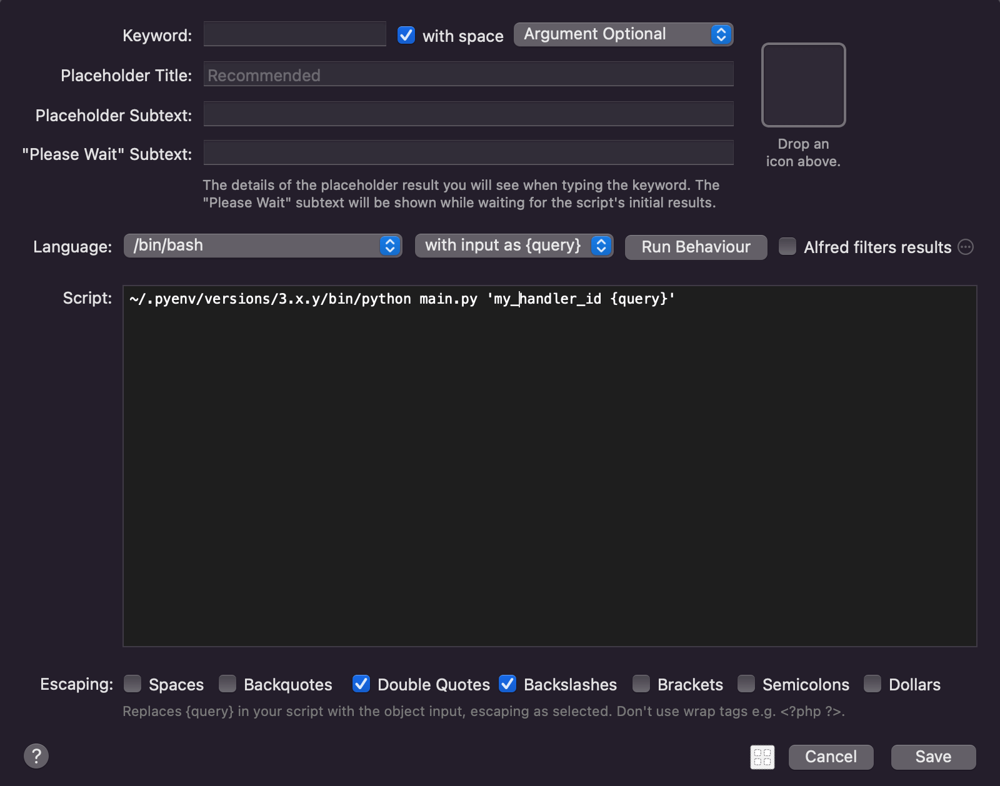

Alfred Workflow Python Development Intro
==============================================================================

Summary
------------------------------------------------------------------------------
这篇文档的目标读者是使用 Python 来开发 Alfred Workflow 的开发者. 本文详细介绍了使用 Python 来开发 Alfred Workflow 的方法.

Why Python?
------------------------------------------------------------------------------
虽然这段的标题是 "为什么用 Python?", 但实际上用任何一种编程语言来写 Alfred Workflow 都可以. 但使用 Python 作为 Alfred Workflow 的主力语言有许多优势:

1. Mac 自带.
2. 脚本语言, 没有冷启动时间. 每当你输入 query 执行命令的时候本质上都是用解释器来运行一段程序, 有的编程语言例如 Java 需要先启动 JVM 虚拟机环境. 这样的额外开销在你敲入每一个字符都会发生, 会降低响应时间和用户体验.
3. 无需编译, 直接把依赖和源代码打包放到对应目录即可生效, 方便开发, 测试, 和部署.
4. 生态强大, 几乎你想得到的任何事情社区都有对应的库.

.. _script-filter-s-script:

Script Filter's Language and Script
------------------------------------------------------------------------------
当你在 Alfred Workflow 中创建了一个 ``Script Filter`` 的控件后, 你会发现这个控件有一个 ``Language`` 和 ``Script`` 的配置项. 这是 Script Filter 的核心配置, 本节重点来介绍这两个配置项.

这两个配置项合起来就构成了每次你在 Alfred 输入框输入字符的时候在后所调用的命令. 例如当 ``Language`` 是 ``/bin/bash`` 而 ``Script`` 是 ``/usr/bin/python3 main.py {query}`` 的时候, 假设你输入的字符是 hello, 那么后台运行的命令就是相当于在 Bash 脚本中运行 ``/usr/bin/python3 main.py hello``. 不得不佩服 Alfred 作者的智慧, 这种设计非常灵活, 使得你几乎可以用任何编程语言做任何事.

那么问题来了, 既然 Script Filter 这么灵活, 有没有一种最佳实践呢? 我这就来介绍一下我的选择.

我们考虑一个简单的功能, 输入 ``repo {query}``, 功能是搜索你自己的 GitHub 账户下所有 public repo, 根据 query 来 filter 出相关的 repo. 我们直接上结论:

.. code-block:: bash

    # 具体的例子
    /usr/bin/python3 main.py 'search_my_public_repo {query}'

    # 抽象的例子
    {path_to_python_interpreter} main.py '{handler_id} {query}'

这里有两个例子, 具体的例子说的是为了实现所述功能, 真实的 ``Script`` 配置. 而抽象的例子则是说你的 ``Script`` 都应该遵循这种模式.

- 这里的 ``{path_to_python_interpreter}`` 是你的 Python 解释器, Mac 12.3 之前自带 Python2, 之后移除了 Python2 只保留了 Python3, 前面这段你可以用来自定义是用哪个 Python 解释器. 你可以用系统自带的 ``/usr/bin/python3`` 或是你自己用 pyenv 或是 homebrew 安装的 Python. 我建议使用 pyenv 安装自己想要的 Python 版本.
- **非常重要**, ``{handler_id}`` 决定了具体使用 ``main.py`` 里面的哪个 Python 函数来处理这个 Query. 这么设计的原因是, 通常你希望用一套代码库, 一套 Python 依赖来构建你的 Workflow, 而你的 Workflow 中可能有很多个不同的函数用来处理不同的 Query, 那么你如何告诉你的 Script Filter 该具体使用哪个逻辑来处理这个 Query 呢? 所以在你给 ``main.py`` 的参数中永远只有一个, 而这个参数第一个空格之前的永远是 ``handler_id``, 而后面的才是真正的 ``query``. 这样可以让你把复杂的逻辑都交给代码来处理, 而不是在 Alfred Workflow Script Filter 的 menu 中处理. 并且这里我们会将 ``handler_id`` 和 ``query`` 都用 ``'`` 包裹起来. 这个语法的含义是将 ``handler_id`` 和 ``query`` 字符串原封不动的当做参数传给 ``main.py``.
- ``main.py`` 脚本具体实现通常从 ``sys.argv`` 中获取 query, 然后将这个字符串解析成结构化的数据, 然后传给真正的业务逻辑函数进行处理. 因为你的业务逻辑可能含有多个复杂的参数, 而用 Python 来解析字符串非常方便, 也便于测试. 这样可以让你的代码更加灵活, 更加容易维护. 你当然可以在 Script Filter 中手写 bash script 将其处理好之后再传给 ``main.py``, 但这样做显然不如直接在 Python 中做方便以及易于维护.

Script Filter's Configuration
------------------------------------------------------------------------------
当你再 Alfred Workflow 中创建了一个 ``Script Filter`` 的控件后, 会出现一个菜单对这个控件进行配置. 那么如何配置这个菜单呢?

Keyword

    没什么好说的, 你想要用哪个 keyword 来调用这个 Workflow.

with space

    勾选, 除非你的 Workflow 不需要 query

Argument Required / Argument Optional / No Argument

    - 如果你的 Workflow 不需要 query, 则选 ``No Argument``.
    - 如果你的 Workflow 需要 query, 而且这个 query 是必须的, 则选 ``Argument Required``.
    - 如果你的 Workflow 需要 query, 但这个 query 是可选的, 则选 ``Argument Optional``, 这是最常见的情况.

Language

    选 ``/bin/bash``, 无论我们用什么编程语言, 我们都用 bash 封装一层, 显式调用我们需要的 Python 解释器的绝对路径.

with input as argv / {query}

    选 ``with input as {query}`` 这个. 如果选 argv 则是用命令行参数的形式调用, 然后让 Alfred 来帮我们自动解析. Python 本身就自带多种解析命令行的库, 我们希望把解析参数的任务交给 Python 而不是 Alfred 进行. 因为解析参数的逻辑本身非常重要且容易出错, 我们用 Python 来做可以用单元测试充分的对其进行测试, 从而保证其正确性.

Run behavior

    Queue mode:

    选 Terminate previous script. 因为通常你敲了一个字符后你之前的输入就没有意义了, 所以我们希望 Alfred 来帮我们杀死之前的输入所对应的进程.

    Query delay:

    - 选 Immediately after each character typed, 除非你的处理逻辑耗时很长, 并且你的 query 一般都是很长要打很多次字.
    - 勾选 Always run immediately for first typed arg character, 因为通常你希望在输入第一个字符后立刻执行逻辑.

    Argument:

    - 选 Automatically trim irrelevant arg whitespaces, 这能自动帮你去除位于末尾的空白字符.
    - 不勾选 Don't set argv when query is empty, 我们用的是 ``with input as {query}``, 这个选项只跟 ``with input as argv`` 有关, 所以这个选项不需要勾选.

Alfred filters results

    不要勾选, 我们不需要 Alfred 帮我们对 Item 进行筛选, 默认的筛选功能会根据单词进行匹配并且会根据 uid 记住你之前的选择. 而把 filter 的功能交给你的代码处理能让你有更大的自由度, 例如你可以用自定义的排序规则, 可以用自动以的全文搜索等等.

Escaping

    只勾选 Double Quotes, Backslashes

Script

    ``{path_to_python_interpreter} main.py '{handler_id} {query}'`` 详情请参考 :ref:`script-filter-s-script`

Send Returned Items to Alfred
------------------------------------------------------------------------------
根据 :ref:`script-filter-programming-model`, 我们知道 Alfred Workflow 的本质就是 输入一个 ``query`` 并返回一堆 ``item`` JSON 对象. 那么在 Python 中我们根据 query 计算出一堆 items 的 JSON 对象后, 我们如何将其发送给 Alfred 呢?

请参考下面的代码, 核心的代码其实只有 2 行. 你在计算出想要展示的 items 后, 你要把这些 items 放在一个 Alfred 所规定的 Script Filter Output 的 dict 对象中. 然后将这个对象用 json 序列化并写入 system standard output buffer 中. 也就是 ``json.dump(script_filter_output, sys.stdout)`` 这一行. 由于 Alfred 会监听 ``sys.stdout``, 你如果将 buffer 中的数据刷新到内存, 就会被 Alfred 所捕捉到并显示出来. 具体做法就是 ``sys.stdout.flush()``

.. code-block:: python

    import sys
    import json

    script_filter_output = {
        "items": [
            {"title": "item 1"},
            {"title": "item 2"},
        ]
    }

    json.dump(script_filter_output, sys.stdout)
    sys.stdout.flush()

Recap
------------------------------------------------------------------------------
根据前面的知识, 使用 Python 开发 Alfred Workflow 的步骤可以大致归纳为:

1. 在 Alfred App 中创建一个 Workflow, 并创建一个 Script Filter Widget, 然后根据上面的介绍配置好.
2. 用 Python 实现一个 ``main.py`` 函数, 它能接受一个 query 字符串, 将其解析为结构化的 data, 执行自定义逻辑, 并返回 JSON 对象, 然后 flush 到 ``sys.stdout`` 中.

第二步看起来很简单, 但是实际上有很多复杂的细节和挑战. 例如:

1. 你本地开发的环境和 Alfred Workflow 最终的目录不是一个. 如何在两者之间快速同步源代码? 不要忘了还有一堆 Python 依赖.
2. 如何进行单元测试?
3. 如何进行集成测试?
4. Alfred UI 中如果出错了, 并不会给你任何提示, 如何进行 debug 呢?

别慌, 这正是 ``afwf`` 这个框架要解决的问题.

What's Next?
------------------------------------------------------------------------------
现在你对用 Python + Script Filter 来编写 Alfred Workflow 可能已经有一定概念了. 下面我们来学习如何用我们这个 ``afwf`` 库来帮助我们更加方便的编写 Alfred Workflow.
