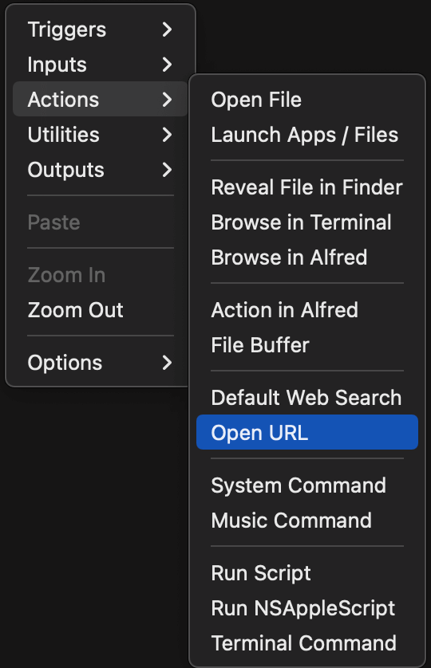
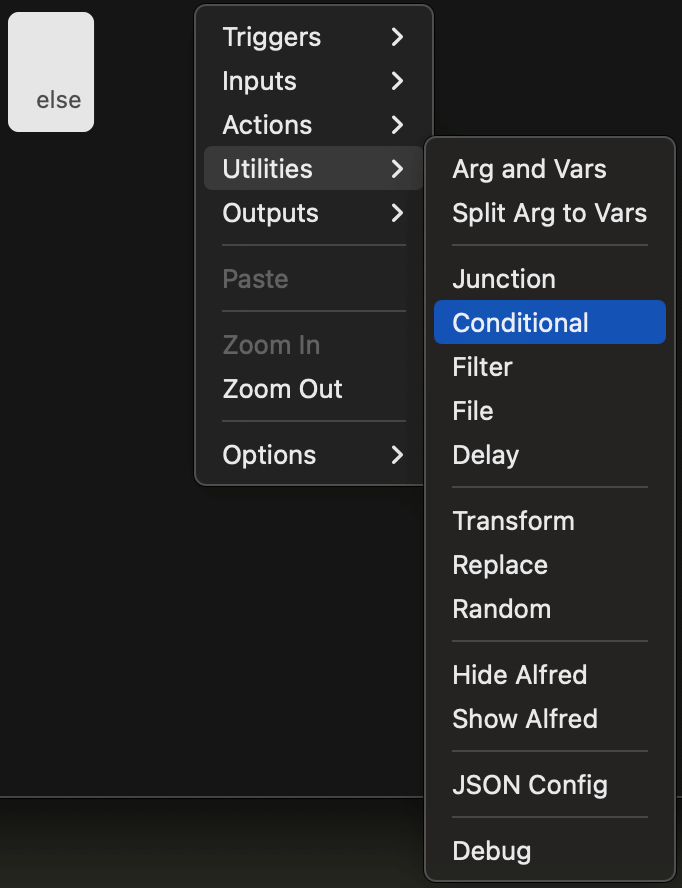
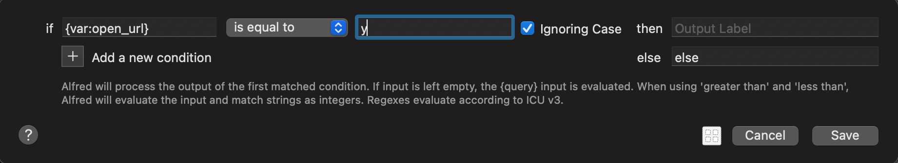
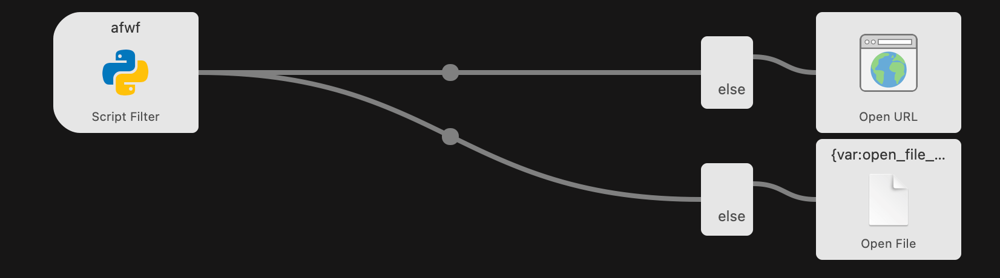
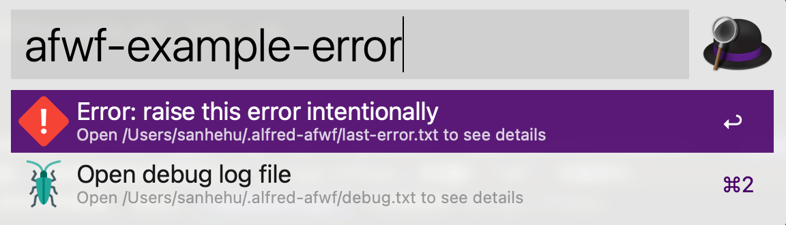
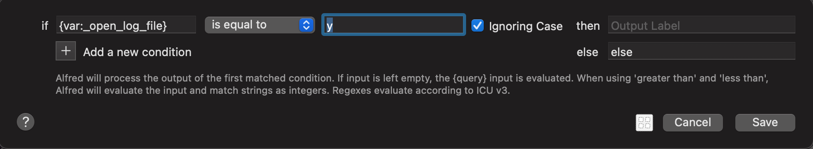
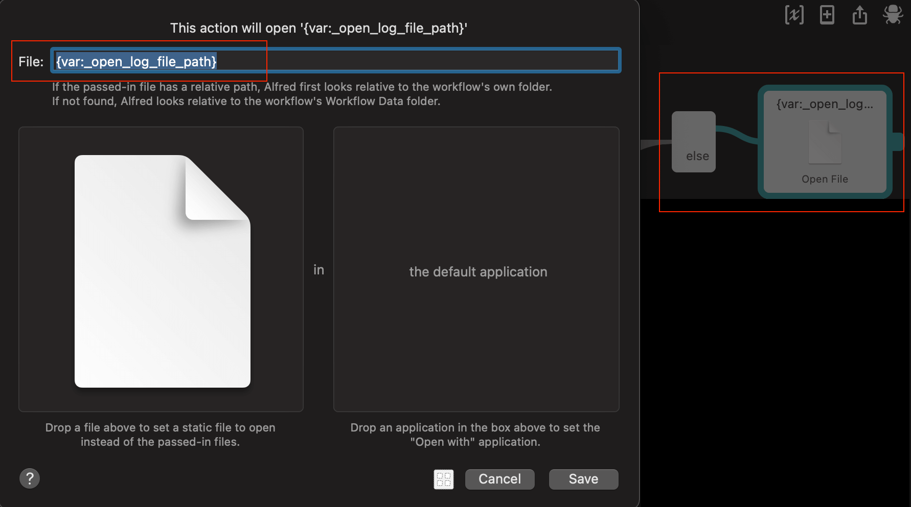

afwf Framework Overview
==============================================================================

Summary
------------------------------------------------------------------------------
这篇文档的目标读者是想用 `afwf <https://github.com/MacHu-GWU/afwf-project>`_ 框架来开发 Alfred Workflow 的开发者. 本文详细的介绍了该框架中提供的各种功能, 以及如何使用这些功能来开发 Alfred Workflow.

Design Philosophy
------------------------------------------------------------------------------
本框架的设计理念是, 极简, 易用, 可插拔, 可扩展. 重点解决的是开发 Workflow 中的痛点. 而把其他业务相关的问题交给开发者自己解决. 例如原来的 alfred-workflow 项目中就带有了太多的组件, 包括 HTTP client, Cache 等. 这些本可以用第三方库 requests 或是 diskcache 来更好的解决. 所以本库只提供了核心的功能, 专注于提供一个接近 Python 原生的开发体验, 而把具体的业务逻辑交给开发者自己去实现.

Import afwf
------------------------------------------------------------------------------
首先, 我们需要导入 ``afwf``. 所有的 public API 都在 ``afwf.api`` 模块下. 请不要用其他方式导入

.. code-block:: python

    import afwf.api as afwf

Important Concepts and Class
------------------------------------------------------------------------------
以下几个类是 Alfred Workflow 开发的核心.

- :class:`~afwf.item.Item`: 代表着 drop down menu 里的一个 item. 它避免了手写 JSON 容易出错的问题, 并且提供了一些方法能通过 `variables <https://www.alfredapp.com/help/workflows/advanced/variables/>`_ 来跟后续的 Widget 互动 (例如在浏览器中打开 URL, 打开文件, 执行命令等).
- :class:`~afwf.script_filter.ScriptFilter`: 代表着 ScriptFilter 对象. 本质上是一个容器, 包含了一堆 items, variables. 用于生成最终的 JSON. 它管理了最终给用户要展示的 items.
- :class:`~afwf.handler.Handler`: 用于处理命令行的输入. 其包含两个抽象函数. :meth:`Handler.main(**kwargs) <afwf.handler.Handler.main>` 实现了你的具体业务逻辑, 输入可以是任何参数组合, 输出必须是一个 :class:`~afwf.script_filter.ScriptFilter` 对象. 这个函数可以被单元测试, 而无需真正运行 Alfred. 另一个则是 :meth:`Handler.handler(query=...) <afwf.handler.Handler.handler>`, 它只有一个输入 ``query``, 是你命令行输入的字符串, 而它仅仅是将 query 解析成具体的参数, 然后传给 :meth:`Handler.main(**kwargs) <afwf.handler.Handler.main>`.
- :class:`~afwf.workflow.Workflow`: 代表着 Workflow 对象. 本质上是一个 Handler 的容器, 可以根据命令行输入中的 handler_id 定位到不同的 Handler 对象, 然后运行不同的逻辑. 它提供了一个 :meth:`Workflow.run(...) <afwf.workflow.Workflow.run>` 方法, 用于运行整个 Workflow. 其中包含了异常处理, 日志记录等功能.

The ``Item`` Class
------------------------------------------------------------------------------
:class:`~afwf.item.Item` 是一个简单的数据容器. 它包含了所有 `Script Filter Item <https://www.alfredapp.com/help/workflows/inputs/script-filter/json/>`_ 的 properties. 用 Python 对象来表示 Item 要比用原生 dict 字典来表示能大幅度提高你的代码的可读性, 可维护性, 避免由于手写 JSON 的错误. 而且可以利用上面向对象编程的种种便利.

例如一个 Item 通常会有下面几个字段:

- ``title``: 大标题
- ``subtitle``: 小标题
- ``arg``: 传递给后续 Widget 的参数
- ``autocomplete``: 按下 tab 键后自动补全的字符串
- ``icon``: 图标

那么你可以这样创建一个 Item:

.. code-block:: python

    item = afwf.Item(
        title='your title',
        subtitle='your subtitle',
        arg='your arg',
        autocomplete='autocomplete query',
        icon='/path/to/icon.png',
    )

.. _follow-up-action-for-item:

Follow up Action for ``Item``
------------------------------------------------------------------------------
当用户在 Drop Down Menu 中选中 Item 后, 按下回车键一般会执行一些操作, 例如在浏览器中打开 URL, 打开指定文件等等. 这些操作叫做 Action. 你在 Alfred Workflow 的编辑界面点击右键即可看到这些选项. 下图给出了目前 Alfred 支持的所有 Action.

那么问题来了, 如何让你 Script Filter 返回的 Item 对象具备这些功能呢? 这里的挑战在于, 你返回的 Item 对应的后续 Action 是不确定的, 例如有些对应 Open URL, 有些对应 Open File. 如果你给 Script Filter 后续连接一堆 Action Widget, 那么你按下回车后会默认触发所有的 Action. 这不是我们需要的. 我们需要的是一种规范能给在代码中定义每个 Item 后续会执行哪些 Action. 无论我们的 Item 对应的 Action 怎么变化, 我们都不希望改动 Alfred Workflow 的 Diagram (因为改代码, 测代码容易, 该 Diagram 测 Diagram 难).

下面我们来看看 ``afwf`` 框架是如何解决这个问题的.

这里的关键是 ``Conditional`` Utility Widget. 它是一个能根据 if else 条件判断是否要执行后续的 Action 的 Widget. 其中在设置判断规则中, 我们用到了 `Variables <https://www.alfredapp.com/help/workflows/advanced/variables/>`_. Variables 是一个可选的 key, value pairs, 每个 Item 都可以有自己的 Variables. 对于每一种 Action, ``afwf`` 框架都定义了特定的 Variables key 和 value. 通常 key 是一个特殊的字符串, 而 value 是 ``y`` 或者 ``n``. 在代码端, 我们可以设定 Variables 来将 Item 标记为是否执行某一种 Action. 而在 Diagram 里, 我们为每个 Script Filter 后续的 Action 之间连接一个 ``Condition``, 并且设定为只有 Variables 中的某个 key 对应的 value 为 ``y`` 时才执行后续的 Action. 然后对于一个 Script Filter, 只要里面的 Item 有可能执行某个 Action, 我们就将它和 Condition 以及 Action Widget 连接上. 而至于执不执行这个 Action, 则由代码决定.

下图展示了如何创建一个 ``Conditional`` Widget.

下图展示了如何设置它的条件. 在这个例子中, 只有 Variables 中的 ``open_url`` 的 Key 对应的 Value 为 ``y`` 时, 才会在浏览器中打开 URL.

:class:`~afwf.item.Item` 类中有许多方法能够让用户方便地将其设定为执行某个 Action. 这些方法都会返回这个 Item 本身, 这意味着你可以链式调用这些方法. 例如: ``item = Item(title=...).open_url("https://www.google.com").open_file("/path/to/file.txt")``. 下面列出了所有跟后续 Action 相关的方法. 方法名和 Alfred Workflow 中的 Action 是一一对应的:

- :meth:`Item.open_file(...) <afwf.item.Item.open_file>`
- :meth:`Item.launch_app_or_file(...) <afwf.item.Item.launch_app_or_file>`
- :meth:`Item.reveal_file_in_finder(...) <afwf.item.Item.reveal_file_in_finder>`
- :meth:`Item.browse_in_terminal(...) <afwf.item.Item.browse_in_terminal>`
- :meth:`Item.browse_in_alfred(...) <afwf.item.Item.browse_in_alfred>`
- :meth:`Item.open_url(...) <afwf.item.Item.open_url>`
- :meth:`Item.run_script(...) <afwf.item.Item.run_script>`
- :meth:`Item.terminal_command(...) <afwf.item.Item.terminal_command>`
- :meth:`Item.send_notification(...) <afwf.item.Item.send_notification>`

下图是一个具体的 Diagram 的例子. 在这个例子中, Item 有可能执行 ``open_url`` 和 ``run_script`` 这两种 Action.

The ``ScriptFilter`` Class
------------------------------------------------------------------------------
:class:`~afwf.script_filter.ScriptFilter` 是一个用来表示 Script Filter 所返回的 JSON 的数据容器. 你可以将 :class:`~afwf.item.Item` 添加到 Script Filter 对象中.

它还有两个重要方法. :meth:`~afwf.script_filter.ScriptFilter.to_script_filter` 可以将 ``ScriptFilter`` 对象序列化为 Alfred 所需的 JSON 字典, 这个方法可以用来做单元测试. 例如你可以指定一个 query, 然后检查它返回的 JSON 是不是符合你的预期. :meth:`~afwf.script_filter.ScriptFilter.send_feedback` 则是一个语法糖, 他能将 ``ScriptFilter`` 对象序列化为 JSON, 并发送给 Alfred App. 你无需显式调用这个方法, ``afwf`` 框架会自动帮你执行这一步.

下面是一个简单的例子.

.. code-block:: python

    import afwf.api as afwf

    sf = afwf.ScriptFilter()
    sf.items.append(afwf.Item(title="my title"))
    sf.send_feedback()

The ``Handler`` Class
------------------------------------------------------------------------------
:class:`~afwf.handler.Handler` 是对输入输出的处理逻辑的抽象. 用户只需要继承这个类, 并且按照框架的规范实现几个方法, 就能完成一个 Alfred Workflow 的 Script Filter 的开发. 换言之, **你每在 Alfred Workflow Diagram 中chuangjianyige Script Filter Widget, 就需要自定义一个 ``Handler`` 的子类**. 用户需要实现下面几个方法:

:meth:`~afwf.handler.Handler.main` (必须实现)

    你需要用该函数实现你的输入输出的处理逻辑. 不过该方法接受任何数量, 任何类型的参数. 它假设你已经将用户的 query 解析成了结构化的数据传给了这个参数. 而你要负责对这些数据处理, 并返回一个 :class:`~afwf.script_filter.ScriptFilter` 对象, 这个 ``ScriptFilter.items`` 中包含了你需要在 Drop Down Menu 中显式的 Item.

:meth:`~afwf.handler.Handler.parse_query` (必须实现)

    你需要用该函数将用户的 query 解析成 :meth:`~afwf.handler.Handler.main` 函数所需的参数. 因为用户在 UI 中输入的 query 可能是任何奇奇怪怪的东西, 例如空字符串, 复制粘贴过来的超长字符串等等. 你需要处理各种各样的 edge case. 这其实是编写 Workflow 中最复杂的部分, 所以我们将其抽象出来成为了一个函数, 方便你对其进行测试.

    ``afwf`` 框架还提供了下面这两个类方便你将用户的 query 解析成结构化的数据:

    - :class:`afwf.query.Query`: 一个方便 query 的数据容器, 包含了 query 的 raw string 以及处理后的结构化数据.
    - :class:`afwf.query.QueryParser`: 一个能把 query string 转化为 :class:`afwf.query.Query`. 其本质上是一个可自定义的 tokenizer.

:meth:`~afwf.handler.Handler.encode_query` (可选实现)

    这个方法可以将 main 中的参数编码成一个 query string 字符串. 它本质上是 :meth:`~afwf.handler.Handler.parse_query` 的反函数. 这个方法常用于一个 Script Filter 中返回的 Item 调用另一个 Script Filter 的情况, 这中间需要用 query string 来传递数据.

除此之外, ``Handler`` 还有这些无需用户实现的方法. 这些方法是在框架内部所使用的, 但用户也可以手动调用它们来 debug.

- :meth:`~afwf.handler.Handler.handler`: 对 :meth:`~afwf.handler.Handler.parse_query`, :meth:`~afwf.handler.Handler.main` 的合并封装.
- :meth:`~afwf.handler.Handler.encode_run_script_command`: 对 :meth:`~afwf.handler.Handler.encode_query` 的封装. 可以生成一个用于被其他 Script Filter 调用自己的的 bash 命令.
- :meth:`~afwf.handler.Handler.run_script_command`: 执行 Alfred Workflow 的底层 Python 命令. 当 UI 工作不符合预期时, 可以用这个方法 debug, 执行底层的 Python 代码.

The ``Workflow`` Class
------------------------------------------------------------------------------
:class:`~afwf.workflow.Workflow` 是帮助开发者实现 :ref:`script-filter-s-script` 中提到的 ``main.py`` 脚本的类. 你的每一个 Alfred Workflow 都需要一个 ``main.py`` 脚本作为 Entry Point. 你需要创建一个 ``Workflow`` 的对象, 然后无论你的 Workflow 中有多少个 Script Filter, 你都需要将它们对应的 :class:`~afwf.handler.Handler` 对象注册到 ``Workflow`` 中. 最后调用 :meth:`~afwf.workflow.Workflow.run` 方法, 它能从 ``sys.argv`` 中读取用户输入的 query, 并且找到对应的 Script Filter ``Handler`` 并且调用它的 :meth:`~afwf.handler.Handler.handler` 方法.

Workflow 类还提供了一些开发者友好的功能, 例如:

- 允许用户不运行 Terminal command, 而是在 Python 代码中自定义输入的来进行测试.
- 自动打 Log, 将输入的 arg, 对应的 handler id, 以及 input query 打到 ``${HOME}/.alfred-afwf/debug.txt`` 日志文件中.
- 自动将 Python 的异常 traceback 新鞋写入到 ``${HOME}/.alfred-afwf/last-error.txt`` 日志文件中. 并且在 Alfred UI 中出现错误时自动展示两个 Item, 方便开发者一键打开日志文件.

下面是一个如何使用 ``Workflow`` 类的例子.

.. literalinclude:: ../../../afwf/example_wf/__init__.py
   :language: python
   :linenos:

下面是一个 ``main.py`` 的例子. 它把前面的例子中的 ``wf`` 对象 import 进来并执行. 我建议你的任何项目都使用这个 ``main.py`` 作为入口, 并且只改动 ``from afwf.example_wf import wf`` 这一行的 import 内容. 然后根据你的项目有多少个 Script Filter, 实现好 ``wf`` 对象即可.
这样你就可以在 ``main.py`` 中做一些全局的配置, 然后在 ``handlers.py`` 中实现你的 Script Filter.

.. literalinclude:: ../../../main.py
   :language: python
   :linenos:

- :class:`~afwf.workflow.Workflow`: 代表着 Workflow 对象. 本质上是一个 Handler 的容器, 可以根据命令行输入中的 handler_id 定位到不同的 Handler 对象, 然后运行不同的逻辑. 它提供了一个 :meth:`Workflow.run(...) <afwf.workflow.Workflow.run>` 方法, 用于运行 Workflow. 其中包含了异常处理, 日志记录等功能. 例如, 当你的 Script Filter 的程序出现异常时, 会自动生成两个 Item 供用户点击. 一个是打开最后的 Python 异常日志文件, 一个是打开 query string 的历史记录和自定义 debug 日志.

下图是一个自动生成的两个 debug Item 的例子.

为了让用户能通过点击打开日志文件, 你需要按照 :ref:`follow-up-action-for-item` 中介绍的方法配置好 Condition 和 Open File Action Widget (注意, ``{var:_open_log_file}`` 和 ``{var:_open_log_file_path}`` 不能错). 然后把你所有的 Script Filter Widget 都跟这个连接上, 下图是一个配置的例子.

Additional Helpers
------------------------------------------------------------------------------
此外本框架还提供了下面的 API 帮助你开发:

- :class:`afwf.workflow.log_debug_info`: 用于将 debug 信息写入到日志文件.
- :class:`afwf.icon.IconFileEnum`: 对框架自带的 Icon 文件的枚举.
- :class:`afwf.item.Icon`: 代表着 item 的 icon.
- :class:`afwf.item.Text`: 代表着你在 CMD + C 复制的字符串, 或是 CMD + L 显示的大型文本.
- :class:`afwf.item.VarKeyEnum`: 一些该框架内使用的 Variable key 的枚举.
- :class:`afwf.item.VarValueEnum`: 一些该框架内使用的 Variable value 的枚举.
- :class:`afwf.item.ModEnum`: 对 modifier key 的枚举.

How to use this Framework In Your Project
------------------------------------------------------------------------------
我提供了一个用该框架写的 `Demo Workflow <https://github.com/MacHu-GWU/afwf_example-project>`_. 它涵盖了如何实现 query 到 item 的输入输出, 如何处理错误, 如何利用缓存, 如何打开 URL, 打开文件, 对文件进行读写等常见操作. 请详细阅读 ``afwf_example`` 项目文档, 你可以参考它来学习如何使用 ``afwf`` 框架, 以及了解一个 Python Alfred Workflow 的 Git Repository 的文件结构应该是怎样的.

What's Next?
------------------------------------------------------------------------------
如果你花了一点时间已经学会了如何使用 ``afwf`` 框架, 我建议你可以进入下一章了解一些 ``afwf`` 框架的其他功能.
