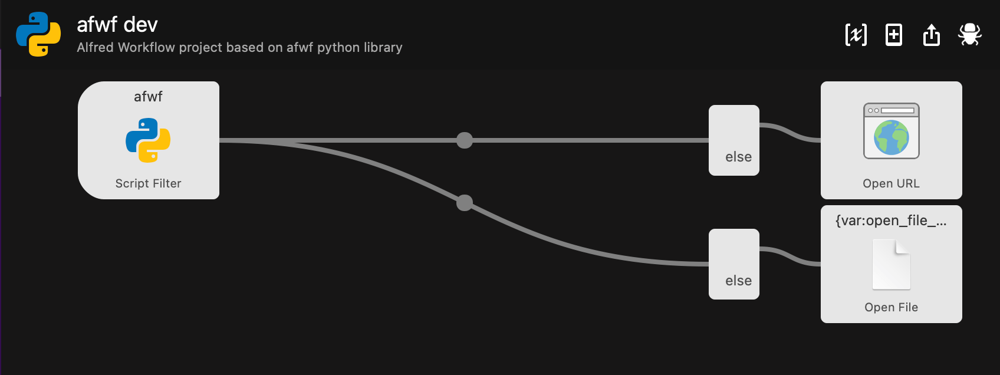
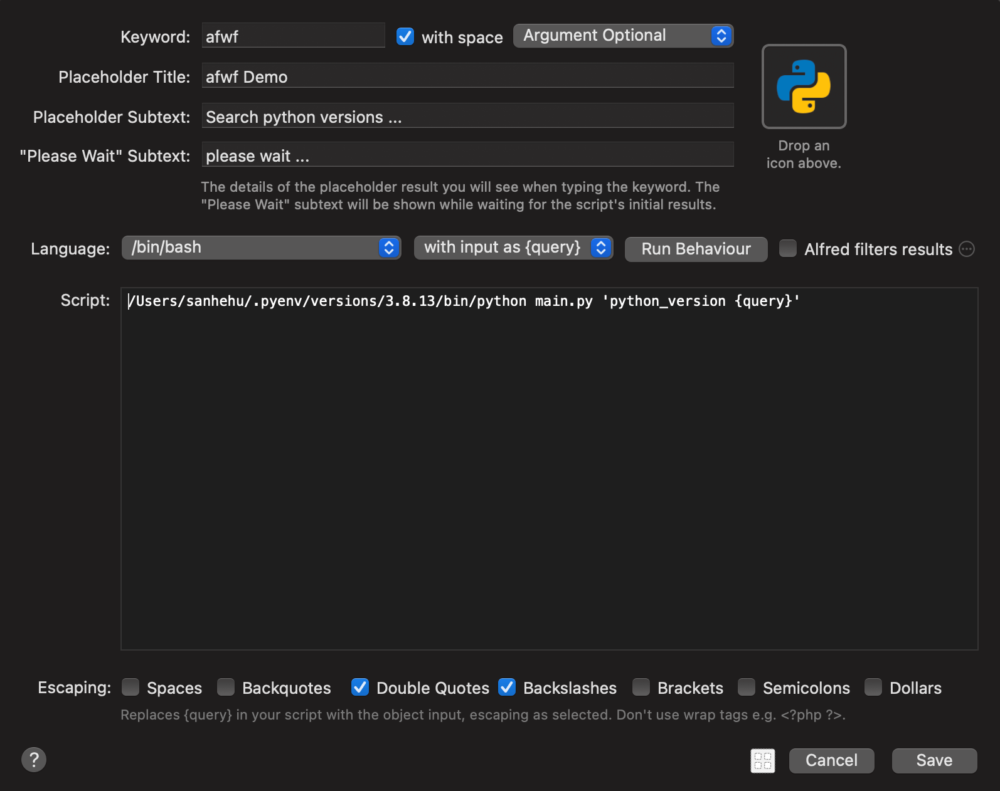
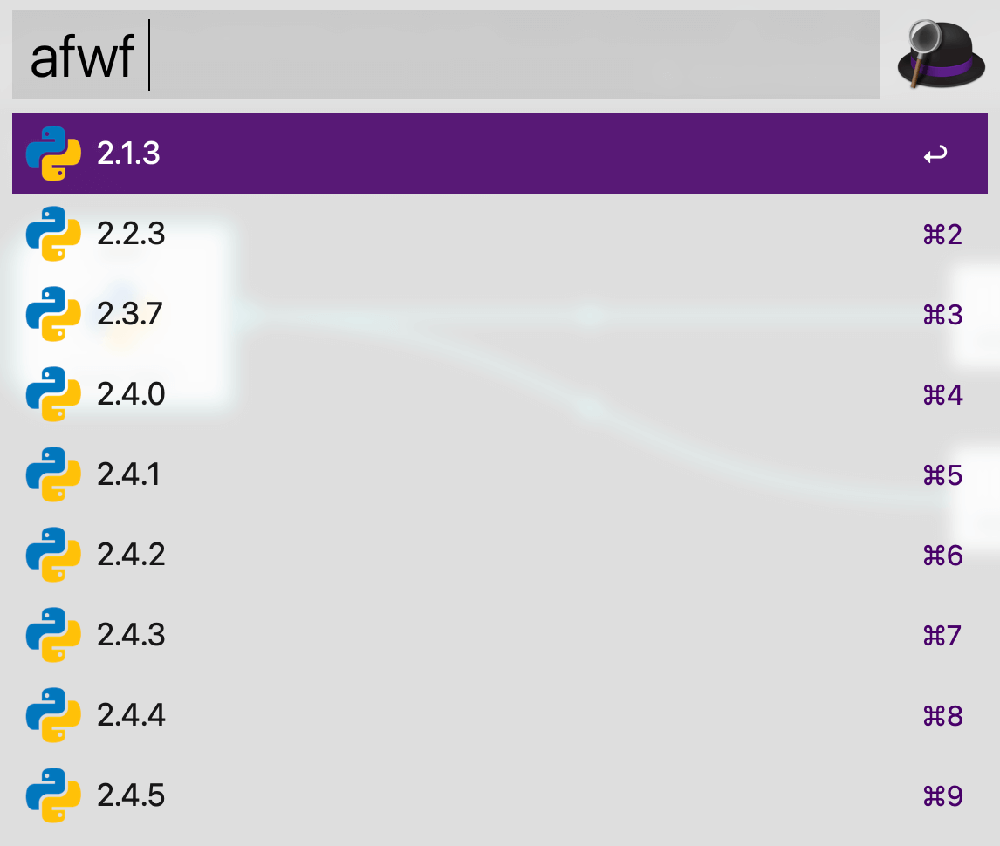
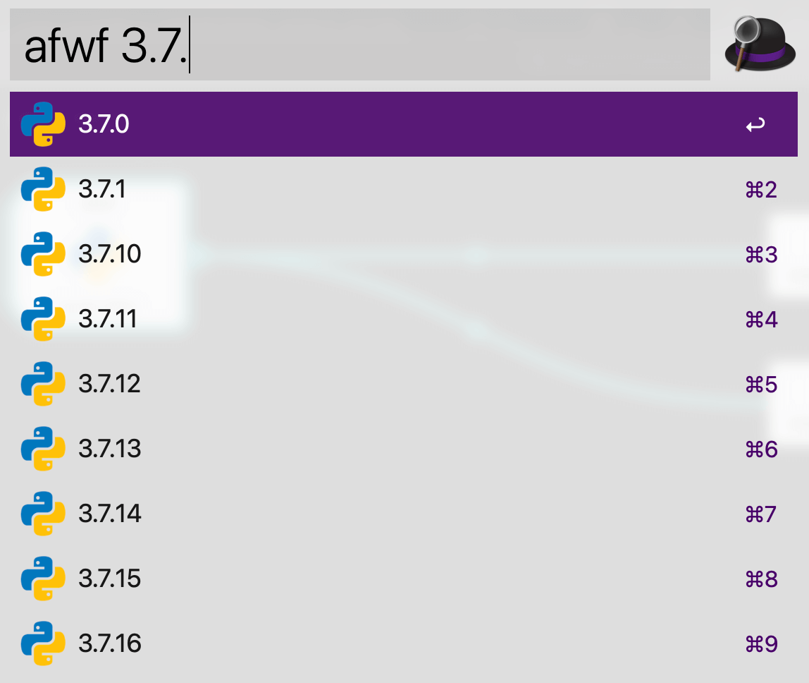

afwf Maintainer Guide
==============================================================================

Summary
------------------------------------------------------------------------------
这篇文档的目标读者是 `afwf-project <https://github.com/MacHu-GWU/afwf-project>`_ 项目的维护者. 详细介绍了 ``afwf`` 项目的维护流程, 如何测试, 以及如何发布新版本.

1. 本地核心功能开发
------------------------------------------------------------------------------

2. Unit Test
------------------------------------------------------------------------------

3. Integration Test
------------------------------------------------------------------------------
测试一个框架最好的方法就是用该框架做一个具体的项目.

在 afwf 的源码中有一个 `example_wf <https://github.com/MacHu-GWU/afwf-project/tree/main/afwf/example_wf>`_ 模块, 它是一个极简的 Workflow, 其功能是到 `pyenv/.../python-build <https://github.com/pyenv/pyenv/tree/master/plugins/python-build/share/python-build>`_ 目录下抓取所有 Python 版本的列表. 如果没有 query 则展示所有版本, 如果有 query 则展示 Python version 中包含 query 的版本 (例如 query 如果是 3.7, 则会返回 3.7.0, 3.7.1, ... 等等). 如果按回车则会在 GitHub 中打开对应的 Python version 所对应的详细内容.

Workflow 的流程如下.

Workflow 的详细设置如下.

Workflow 的使用效果 1.

Workflow 的使用效果 2.

具体的输入输出逻辑实现请参考 `afwf/example_wf/handlers
/python_version.py <https://github.com/MacHu-GWU/afwf-project/blob/main/afwf/example_wf/handlers/python_version.py>`_, 而对 Workflow 的封装请参考 `afwf/example_wf
/__init__.py <https://github.com/MacHu-GWU/afwf-project/blob/main/afwf/example_wf/__init__.py>`_.

实现了核心逻辑之后, 就可以进行本地单元测试了, 单元测试的代码请参考 `tests/example_wf <https://github.com/MacHu-GWU/afwf-project/tree/main/tests/example_wf>`_.

单元测试通过之后, 就可以根据上图实际创建一个 Alfred Workflow 进行集成测试了. 在 Alfred 中创建好 Workflow 之后, 右键点击 Open in Finder 获得这个 Workflow 的路径. 然后将这个路径放到 `bin/automation/paths.py <https://github.com/MacHu-GWU/afwf-project/blob/main/bin/automation/paths.py#L66>`_ 中. 这是一个 shell script, 它能自动将你的 Workflow 部署到 Alfred 的 Workflow 目录下, 其工作包括安装依赖, 刷新代码. 你可以用 `bin/s01_build_wf.py <https://github.com/MacHu-GWU/afwf-project/blob/main/bin/s01_build_wf.py>`_ 来重新构建你的 Workflow, 以及用 `bin/s02_refresh_code.py <https://github.com/MacHu-GWU/afwf-project/blob/main/bin/s02_refresh_code.py>`_ 来仅刷新源代码而跳过安装依赖.

构建完你的 Workflow 之后, 你可以实际使用 Alfred 来测试你的 Workflow, 也可以用 `bin/debug.py <https://github.com/MacHu-GWU/afwf-project/blob/main/bin/debug.py>`_ 脚本模拟 Alfred 的 Script Filter 的输入输出来进行测试. 这样做的好处是能展现实际错误. Alfred Workflow 如果有逻辑错误, 在 UI 界面上是不会有任何提示的, 而且 Alfred 的 debug 功能跟 Python 的 debug 功能比还是差远了. 所以我推荐用这种方式 debug.
