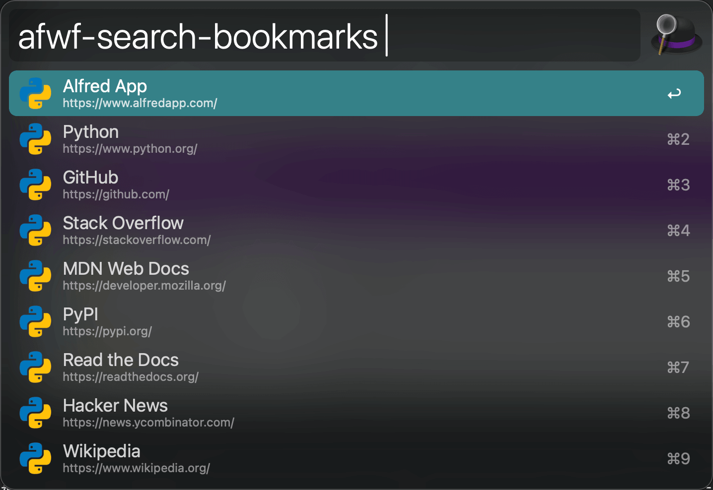
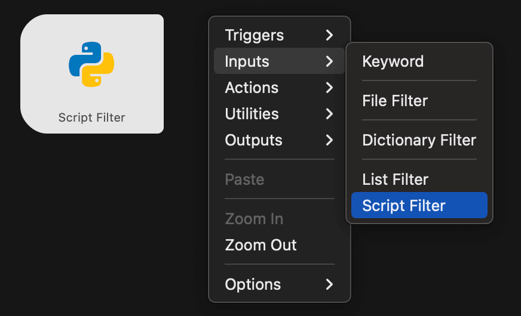

.. _Alfred-Workflow-Script-Filter:

Alfred Workflow Script Filter
==============================================================================

Summary
------------------------------------------------------------------------------

This document is the first in a series on building Alfred Workflows with Python.
The killer feature of Alfred Workflows is the `Script Filter <https://www.alfredapp.com/help/workflows/inputs/script-filter/>`_,
which lets you handle user input from the Alfred UI and return a list of items in a dropdown menu — using any programming language you choose.
Because you can use any language, you can in theory make Alfred do anything.
We start by introducing the Script Filter.

How the Alfred UI Works
------------------------------------------------------------------------------

Before diving into Script Filter, let us look at the underlying interaction model of the Alfred UI.
Alfred is a launcher at heart. Every interaction follows the same pattern: the user types a **Keyword** followed by a **Query String**.
The Keyword determines which logic handles the input; the Query String is the input itself.
That logic processes the query and returns a set of results, displayed as a **Dropdown Menu** for the user to act on.

In the screenshot below, typing the keyword ``afwf-example-open-url`` shows a list of URLs.
As you type a query, the list is re-ranked by how well each URL title matches your input.
Pressing Enter opens the selected URL.
Each selectable entry is called an **Item** — a JSON object with a title, subtitle, and icon.

So the three pieces that matter are the Query String (input), the Keyword (a block of logic written in code), and the Dropdown Menu (output).
This maps directly onto the concept of a function: the Keyword is the function, the Query String is the argument, and the Dropdown Menu is the return value.
To build any feature, you implement that function in your preferred language.

What Is a Script Filter?
------------------------------------------------------------------------------

A Script Filter is the most powerful widget in Alfred Workflows.
When the user types a query, Alfred passes it as input to a script you write in any programming language.
Your script processes the query and returns a JSON object that Alfred renders as the Dropdown Menu.

Alfred's own file-search feature works this way: typing ``open {query}`` triggers Alfred's built-in logic,
which queries macOS file metadata and returns matching files as a dropdown.
Script Filter gives you the same power for your own logic.
If you know a little programming, you can implement any handler you can imagine — Alfred supports every language you can install on macOS.

.. _script-filter-programming-model:

Script Filter Programming Model
------------------------------------------------------------------------------

Here we use Python as the example (Alfred supports any language — Java, Ruby, Go, and others work fine
as long as you have the runtime installed).

Each time the user types a query, Alfred runs a shell command you configure, for example::

    /usr/bin/python main.py '{query}'

Your ``main.py`` receives the query, processes it, and prints a JSON object to **stdout**.
Alfred captures that output and renders it as the Dropdown Menu.

The JSON must contain an ``items`` array. Each element of that array is an **Item object** representing one
entry in the dropdown. An Item can carry a title, a subtitle, an argument (what happens when you press Enter),
and modifier-key overrides (what happens when you hold Cmd, Shift, Alt, or Ctrl).

For example, a workflow that always returns a single "Hello Alfred User" item that opens the Alfred website
on Enter would print::

    {
        "items": [
            {
                "uid": "i-1",
                "title": "Hello Alfred User",
                "subtitle": "open https://www.alfredapp.com/ in browser",
                "arg": "https://www.alfredapp.com/"
            }
        ]
    }

References:

- Script Filter JSON protocol: https://www.alfredapp.com/help/workflows/inputs/script-filter/json/
- Example implementation by the alfred-workflow author: https://github.com/deanishe/alfred-workflow/blob/master/workflow/workflow.py#L2176

What's Next?
------------------------------------------------------------------------------

You now understand how Alfred's Script Filter works.
Move on to the next document to learn how to build Alfred Workflows with Python.
