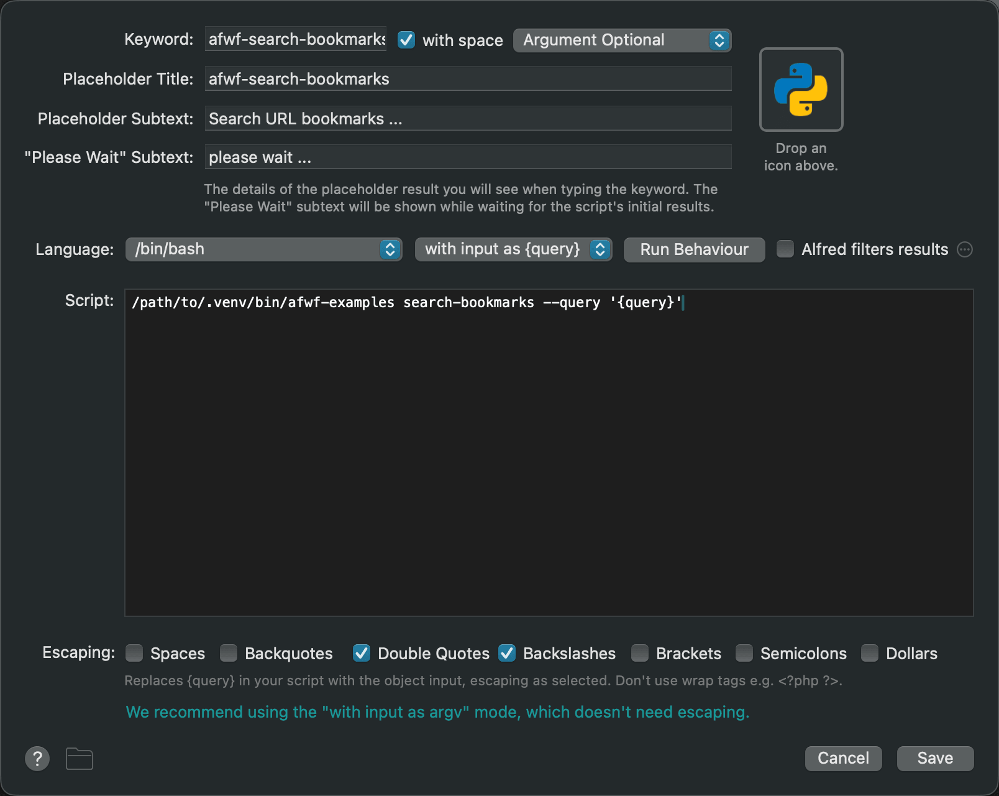

.. _Alfred-Workflow-Python-Development-Intro:

Alfred Workflow Python Development Intro
==============================================================================

Summary
------------------------------------------------------------------------------

This document is aimed at developers who want to build Alfred Workflows in Python.
It explains the mechanics of connecting a Script Filter to Python code and introduces
the recommended deployment model using ``uvx``.

Why Python?
------------------------------------------------------------------------------

Alfred supports any language, but Python is a natural fit for workflow development:

1. No cold-start overhead — Python is an interpreter; each keystroke runs the script directly without spinning up a VM.
2. No compilation step — iterate fast during development; ship a normal package for production.
3. Rich ecosystem — almost any task you want to automate already has a library.

.. _script-filter-s-script:

Script Filter's Language and Script
------------------------------------------------------------------------------

When you add a Script Filter widget to an Alfred Workflow, you configure two fields:
**Language** and **Script**.
Together they form the shell command Alfred runs every time you type a character.

The recommended approach is one Script Filter → one Python CLI subcommand, invoked through ``uvx``.

**Why uvx?**

`uvx <https://docs.astral.sh/uv/guides/tools/>`_ downloads, caches, and runs a pinned PyPI package on demand.
There is no virtualenv to maintain, no path hardcoding, and no per-machine setup.
Upgrading a workflow is a version bump in PyPI and a one-line change in Alfred.

**Configuration:**

- **Language**: ``/bin/bash``
- **Script** (production)::

    ~/.local/bin/uvx --from your-package==1.0.0 your-cli subcommand --query '{query}'

- **Script** (local dev, pointing at your venv directly)::

    ~/path/to/your-project/.venv/bin/your-cli subcommand --query '{query}'

Each Script Filter maps to exactly one subcommand.
For example, a ``search-bookmarks`` Script Filter would look like::

    ~/.local/bin/uvx --from afwf==${version} afwf-examples search-bookmarks --query '{query}'

The subcommand receives a structured ``--query`` argument and is responsible for computing the result and
printing the Alfred JSON to stdout. There is no ``handler_id``, no ``main.py`` dispatcher, and no shared
entry point across multiple Script Filters.

Script Filter's Configuration
------------------------------------------------------------------------------

After creating a Script Filter widget in Alfred, configure the settings panel as follows:

**Keyword**
    The keyword the user types to trigger this workflow.

**with space**
    Check this, unless your workflow requires no query.

**Argument Required / Argument Optional / No Argument**
    - ``No Argument`` — workflow needs no query.
    - ``Argument Required`` — query is mandatory.
    - ``Argument Optional`` — query is optional (most common case).

**Language**
    Select ``/bin/bash``. We always wrap the call in bash so we can specify the full path to ``uvx``.

**with input as argv / {query}**
    Select ``with input as {query}``. The ``{query}`` placeholder is substituted by Alfred and passed
    as the value of ``--query``. This keeps query parsing inside Python where it can be unit-tested.

**Run behavior**

    *Queue mode*: ``Terminate previous script`` — when the user types a new character, the previous
    invocation is no longer relevant, so kill it immediately.

    *Query delay*: ``Immediately after each character typed`` works well for fast commands.
    Check ``Always run immediately for first typed arg character``.

    *Argument*: Check ``Automatically trim irrelevant arg whitespaces``.

**Alfred filters results**
    Leave unchecked. Let your Python code handle filtering and ranking; this gives you full control
    over fuzzy matching, custom sort orders, and result freshness.

**Escaping**
    Check only ``Double Quotes`` and ``Backslashes``.

**Script**
    See :ref:`script-filter-s-script`.

Sending Items to Alfred
------------------------------------------------------------------------------

Every Script Filter subcommand follows the same output contract: compute a list of items,
serialize them to the Alfred JSON format, and write the result to **stdout**.

The minimal shape Alfred expects is::

    {
        "items": [
            {"title": "item 1"},
            {"title": "item 2"}
        ]
    }

In plain Python, that is two lines:

.. code-block:: python

    import sys
    import json

    script_filter_output = {
        "items": [
            {"title": "item 1"},
            {"title": "item 2"},
        ]
    }

    json.dump(script_filter_output, sys.stdout)
    sys.stdout.flush()

In practice you will never write this by hand — ``afwf`` provides typed classes
(:class:`~afwf.item.Item`, :class:`~afwf.script_filter.ScriptFilter`) and a
``send_feedback()`` method that handles serialization and flushing for you.

What's Next?
------------------------------------------------------------------------------

You now understand how a Script Filter connects to Python code and how the ``uvx`` deployment
model works. The next document walks through the ``afwf`` framework — the typed classes and
helpers that eliminate the boilerplate shown above.
