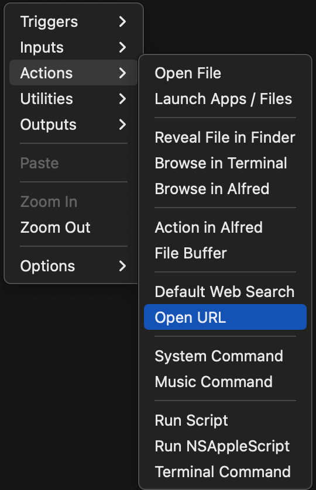
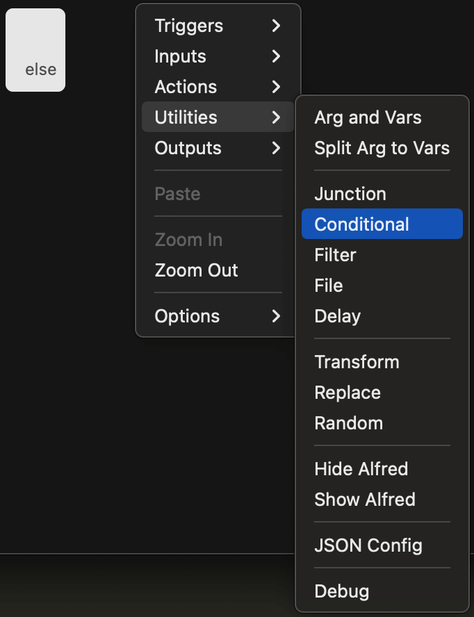
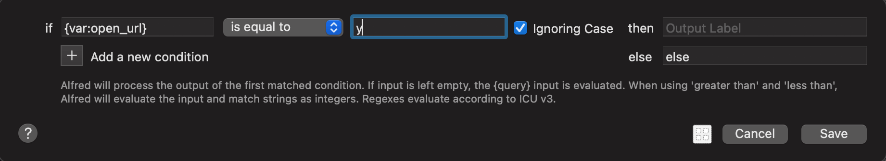
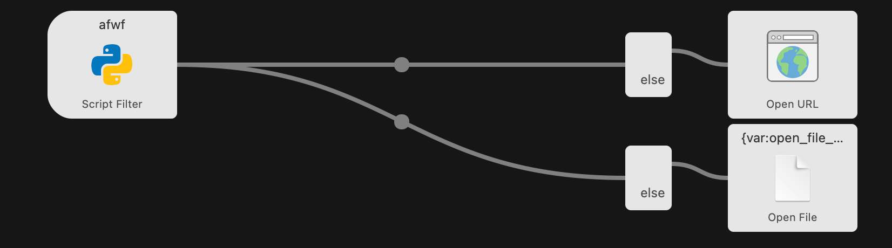

afwf Framework Overview
==============================================================================

Summary
------------------------------------------------------------------------------

This document is for developers who want to use the
`afwf <https://github.com/MacHu-GWU/afwf-project>`_ framework to build Alfred Workflows.
It explains the core classes, the follow-up action model, and how everything fits together
into a ``fire`` CLI that Alfred calls via ``uvx``.

Design Philosophy
------------------------------------------------------------------------------

``afwf`` is minimal and focused. It solves the parts of Alfred Workflow development that are
genuinely painful — hand-crafted JSON, action routing, query parsing — and leaves everything
else to standard Python libraries. There is no HTTP client, no magic config system.
The goal is a Python-native development experience with full unit-test coverage.

Import afwf
------------------------------------------------------------------------------

All public API is in ``afwf.api``:

.. code-block:: python

    import afwf.api as afwf

The ``Item`` Class
------------------------------------------------------------------------------

:class:`~afwf.item.Item` represents one entry in the Alfred dropdown menu.
Using a Python object instead of a raw dict eliminates typos in key names and gives you
IDE completion across the full
`Script Filter JSON spec <https://www.alfredapp.com/help/workflows/inputs/script-filter/json/>`_:

.. code-block:: python

    item = afwf.Item(
        title="Alfred Documentation",
        subtitle="Open in browser",
        arg="https://www.alfredapp.com/help/",
        autocomplete="alfred docs",
        icon=afwf.Icon(path="/path/to/icon.png"),
    )

All ``set_*`` and action methods return ``self``, so calls can be chained.

.. _follow-up-action-for-item:

Follow-up Actions for ``Item``
------------------------------------------------------------------------------

When the user presses Enter on an item, Alfred can take a follow-up action — open a URL,
open a file, run a script, and so on. Alfred supports many action types:

The challenge is that different items in the same Script Filter may need different actions.
``afwf`` solves this with Alfred's
`Conditional widget <https://www.alfredapp.com/help/workflows/utilities/conditional/>`_ and
`Variables <https://www.alfredapp.com/help/workflows/advanced/variables/>`_.

Each :class:`~afwf.item.Item` can carry a set of ``variables`` — key/value pairs that travel
with the item when the user selects it. ``afwf`` defines a fixed set of semantic variable keys
(see :class:`~afwf.constants.VarKeyEnum`, :class:`~afwf.constants.VarValueEnum`).
Calling an action method on an item sets the corresponding variable to ``"y"``:

.. code-block:: python

    item = afwf.Item(title="Open Alfred homepage", arg="https://www.alfredapp.com/")
    item.open_url("https://www.alfredapp.com/")   # sets variables["open_url"] = "y"

In the Alfred Workflow diagram, you connect each Script Filter to its possible action widgets
through a **Conditional** utility widget that checks whether the variable is ``"y"``:

This way the diagram stays static — no matter how many item types you add, you never touch
the diagram again. The Python code controls which action fires.

Below is a concrete diagram where items may trigger either ``open_url`` or ``run_script``:

The full list of action methods on :class:`~afwf.item.Item`:

- :meth:`~afwf.item.Item.open_file`
- :meth:`~afwf.item.Item.launch_app_or_file`
- :meth:`~afwf.item.Item.reveal_file_in_finder`
- :meth:`~afwf.item.Item.browse_in_terminal`
- :meth:`~afwf.item.Item.browse_in_alfred`
- :meth:`~afwf.item.Item.open_url`
- :meth:`~afwf.item.Item.run_script`
- :meth:`~afwf.item.Item.terminal_command`
- :meth:`~afwf.item.Item.send_notification`

The ``ScriptFilter`` Class
------------------------------------------------------------------------------

:class:`~afwf.script_filter.ScriptFilter` is the top-level response object.
Add items to it, then either inspect it in a test or send it to Alfred:

.. code-block:: python

    sf = afwf.ScriptFilter()
    sf.items.append(afwf.Item(title="Hello"))

    sf.to_script_filter()   # → dict  — use in unit tests to assert output
    sf.send_feedback()      # → writes JSON to stdout, picked up by Alfred

Building a Script Filter Handler
------------------------------------------------------------------------------

Each Script Filter is a plain Python function that accepts a query string and returns a
:class:`~afwf.script_filter.ScriptFilter`:

.. code-block:: python

    import afwf.api as afwf

    def search_bookmarks(query: str = "") -> afwf.ScriptFilter:
        bookmarks = [
            ("Alfred App",  "https://www.alfredapp.com/"),
            ("Python Docs", "https://docs.python.org/"),
        ]
        sf = afwf.ScriptFilter()
        for title, url in bookmarks:
            item = afwf.Item(title=title, subtitle=url, arg=url).open_url(url)
            sf.items.append(item)
        return sf

There is no base class to inherit, no ``parse_query`` method to override.
The function is a pure Python callable — straightforward to unit-test without Alfred running.

For query parsing utilities see :class:`~afwf.query.QueryParser` and :class:`~afwf.query.Query`.
For automatic error capture see the :func:`~afwf.decorator.log_error` decorator.

CLI Entry Point with ``fire``
------------------------------------------------------------------------------

Expose each handler as a subcommand of a
`fire <https://github.com/google-deepmind/python-fire>`_ CLI:

.. code-block:: python

    # your_package/cli.py
    import fire
    import afwf.api as afwf
    from .handlers import search_bookmarks, open_recent_files

    class Command:
        def search_bookmarks(self, query: str = "") -> None:
            search_bookmarks(query).send_feedback()

        def open_recent_files(self, query: str = "") -> None:
            open_recent_files(query).send_feedback()

    def main():
        fire.Fire(Command)

Declare the entry point in ``pyproject.toml``:

.. code-block:: toml

    [project.scripts]
    my-workflow = "your_package.cli:main"

Each Alfred Script Filter maps to exactly one subcommand.
No ``main.py``, no ``handler_id``, no shared dispatcher.

Deployment with ``uvx``
------------------------------------------------------------------------------

Publish the package to PyPI, then point Alfred's Script field at it:

.. code-block:: bash

    # production
    ~/.local/bin/uvx --from your-package==1.0.0 my-workflow search-bookmarks --query '{query}'

    # local dev (pointing at your venv)
    ~/path/to/project/.venv/bin/my-workflow search-bookmarks --query '{query}'

``uvx`` downloads, caches, and runs the pinned version on demand.
No virtualenv to maintain, no per-machine setup.
Upgrading a workflow is a version bump and a one-line change in Alfred.

Additional Helpers
------------------------------------------------------------------------------

- :class:`~afwf.icon.IconFileEnum` — paths to ~50 bundled PNG icons (search, folder, star, error, …)
- :class:`~afwf.item.Icon` — icon model for an :class:`~afwf.item.Item`
- :class:`~afwf.item.Text` — controls the text shown on ``Cmd+C`` (copy) and ``Cmd+L`` (large type)
- :class:`~afwf.query.QueryParser` — configurable tokenizer for Alfred's raw query string
- :class:`~afwf.query.Query` — structured container produced by ``QueryParser``
- :func:`~afwf.decorator.log_error` — decorator that catches exceptions, writes the traceback to ``~/.alfred-afwf/last-error.txt``, and returns a fallback ``ScriptFilter`` with debug items
- :class:`~afwf.constants.VarKeyEnum`, :class:`~afwf.constants.VarValueEnum` — semantic variable key/value constants used by the action methods
- :class:`~afwf.constants.ModEnum` — modifier key constants (``cmd``, ``shift``, ``alt``, ``ctrl``)

What's Next?
------------------------------------------------------------------------------

Now that you understand the core model, move on to the next document for a deeper look at
optional utilities — fuzzy matching and disk caching — and the full deployment walkthrough.
